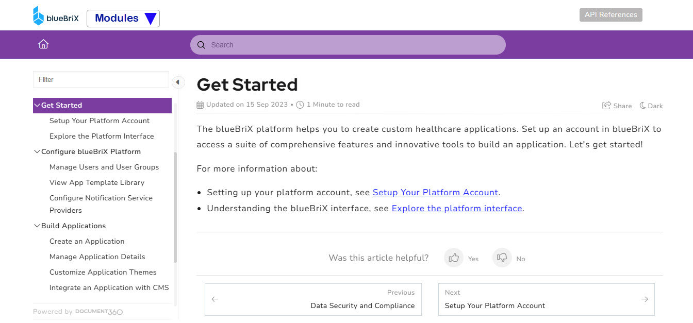

# Welcome to blueBriX's Knowledge Base!
Answers to your queries are just a search away
 

| | | |
|---|---|---|
| 
 <a href="--!" target="_blank" rel="noopener noreferrer"> 
  
 
 <h3 class="top-category-title">Introduction</h3> 
--!
 
 </a> 
 | 
 <a href="--!" target="_blank" rel="noopener noreferrer"> 
  
 
 <h3 class="top-category-title">Benefits</h3> 
--!
 
 </a> 
 | 
 <a href="--!" target="_blank" rel="noopener noreferrer"> 
  
 
 <h3 class="top-category-title">Architecture</h3> 
--!
 
 </a> 
 |
| 
 <a href="--!" target="_blank" rel="noopener noreferrer"> 
  
 
 <h3 class="top-category-title">Modules</h3> 
--!
 
 </a> 
 | 
 <a href="--!" target="_blank" rel="noopener noreferrer"> 
  
 
 <h3 class="top-category-title">Certifications and Compliance</h3> 
--!
 
 </a> 
 | 
 <a href="--!" target="_blank" rel="noopener noreferrer"> 
  
 
 <h3 class="top-category-title">Process</h3> 
--!
 
 </a> 
 |

# Modules

| | | |
|---|---|---|
| 
 <a href="--!" target="_blank" rel="noopener noreferrer"> 
  
 
 <h3 class="top-category-title"> DevOps Platform</h3> 
--!
 
 </a> 
 | 
 <a href="--!" target="_blank" rel="noopener noreferrer"> 
  
 
 <h3 class="top-category-title">blueEHR</h3> 
--!
 
 </a> 
 | 
 <a href="--!" target="_blank" rel="noopener noreferrer"> 
  
 
 <h3 class="top-category-title">blueIntelligence (Data Lake)</h3> 
--!
 
 </a> 
 |
| 
 <a href="--!" target="_blank" rel="noopener noreferrer"> 
  
 
 <h3 class="top-category-title">blueTelemed</h3> 
--!
 
 </a> 
 | 
 <a href="--!" target="_blank" rel="noopener noreferrer"> 
  
 
 <h3 class="top-category-title">Patient Health Records</h3> 
--!
 
 </a> 
 | 
 <a href="--!" target="_blank" rel="noopener noreferrer"> 
  
 
 <h3 class="top-category-title">RCM</h3> 
--!
 
 </a> 
 |

